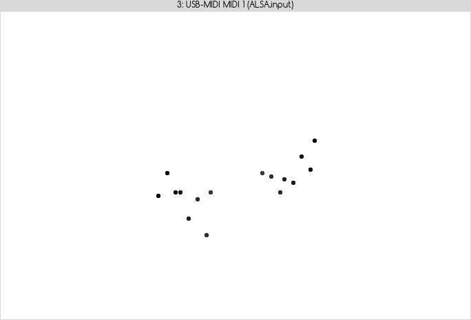

MIDI Keyboard Trainer
=====================

Simple practice tool for training piano fingering strength.

The tool is rather simple

Can be used as an example how to use [PortMidi](http://hackage.haskell.org/package/PortMidi)
(a Haskell binding for PortMedia/PortMidi)
and [uni-htk](https://hackage.haskell.org/package/uni-htk)
(GUI toolkit based on Tcl/Tk).

More examples of uni-htk use can be found at
<https://svn-agbkb.informatik.uni-bremen.de/uni/trunk/htk/examples/>

TODO
====

* List only input devides (with no argument given).
* Make possiblity to run against stream of random events.
* Make random events less random (so it looks a little more like actual play).
  (Nothing complicated, just from full range random just just delta).
* Figure out how to make canvas recompute its size on resize.
* Select midi device on runtime.
* Play a little with visuals (more intuitive visualization).
